# MPDS - Watch Store E-commerce Platform

## Table of Contents

1. [Project Overview](#1-project-overview)
2. [Technology Stack](#2-technology-stack)
3. [System Architecture](#3-system-architecture)
4. [Project Structure](#4-project-structure)
5. [Database Design](#5-database-design)
6. [Class Diagram](#6-class-diagram)
7. [Use Case Diagram](#7-use-case-diagram)
8. [Sequence Diagrams](#8-sequence-diagrams)
9. [Component Diagram](#9-component-diagram)
10. [API Documentation](#10-api-documentation)
11. [Security Configuration](#11-security-configuration)
12. [Installation Guide](#12-installation-guide)
13. [Features Summary](#13-features-summary)

---

## 1. Project Overview

**MPDS (Watch Store)** is a full-featured e-commerce web application for selling watches. The platform supports multiple user roles (Guest, User, Seller, Admin) with features including product browsing, shopping cart, checkout, online payment integration (VNPay), user authentication with OTP verification, and comprehensive admin dashboard for managing products, orders, and users.

### Key Features

| Feature | Description |
|---------|-------------|
| Product Catalog | Browse watches with filters (Brand, Type, Strap, Dial Size, Gender) |
| Shopping Cart | Session-based cart management |
| User Authentication | Login, Register with OTP email verification |
| Password Recovery | Forgot password with OTP verification |
| Checkout | Multiple payment methods (COD, VNPay) |
| User Profile | View orders, change password, update profile |
| Admin Dashboard | Statistics, revenue charts, order management |
| Product Management | CRUD operations for products, brands, types, straps |
| User Management | Manage users and roles |
| Invoice Management | Track and update order status |

### Contributors
- Nguyen Viet Anh
- Le Y Thien

---

## 2. Technology Stack

### Backend

| Technology | Version | Purpose |
|------------|---------|---------|
| Java | 17 | Programming Language |
| Spring Boot | 3.1.0 | Application Framework |
| Spring Security | 3.0.6 | Authentication & Authorization |
| Spring Data JPA | 3.1.0 | ORM & Database Access |
| Hibernate | 6.x | JPA Implementation |
| Thymeleaf | 3.1.x | Template Engine |
| Lombok | 1.18.34 | Code Generation |
| Jackson | 2.15.0 | JSON Processing |

### Database

| Technology | Version | Purpose |
|------------|---------|---------|
| MySQL | 8.x | Relational Database |
| AWS RDS | - | Cloud Database Hosting |

### Frontend (Server-Side Rendered)

| Technology | Purpose |
|------------|---------|
| Thymeleaf | HTML Template Engine |
| Bootstrap | CSS Framework |
| JavaScript/jQuery | Client-side Interactivity |
| Swiper.js | Image Carousels |
| Chart.js | Admin Dashboard Charts |

### External Services

| Service | Purpose |
|---------|---------|
| VNPay | Online Payment Gateway |
| Gmail SMTP | Email Service for OTP |

### Build & Deployment

| Tool | Purpose |
|------|---------|
| Maven | Dependency Management & Build |
| Spring Boot Maven Plugin | Executable JAR Packaging |

---

## 3. System Architecture

### 3.1 High-Level Architecture

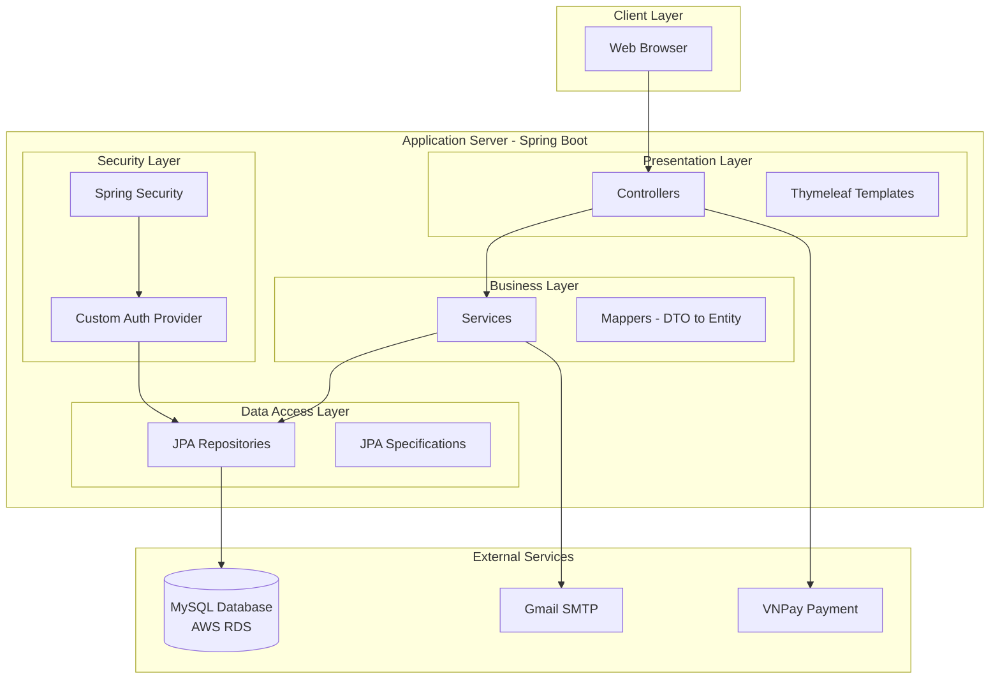
```mermaid
flowchart TB
    subgraph Client["Client Layer"]
        Browser["Web Browser"]
    end
    
    subgraph Server["Application Server - Spring Boot"]
        subgraph Presentation["Presentation Layer"]
            Controllers["Controllers"]
            Thymeleaf["Thymeleaf Templates"]
        end
        
        subgraph Business["Business Layer"]
            Services["Services"]
            Mappers["Mappers - DTO to Entity"]
        end
        
        subgraph Data["Data Access Layer"]
            Repositories["JPA Repositories"]
            Specifications["JPA Specifications"]
        end
        
        subgraph Security["Security Layer"]
            SecurityConfig["Spring Security"]
            AuthProvider["Custom Auth Provider"]
        end
    end
    
    subgraph External["External Services"]
        MySQL[("MySQL Database\nAWS RDS")]
        VNPay["VNPay Payment"]
        SMTP["Gmail SMTP"]
    end
    
    Browser --> Controllers
    Controllers --> Services
    Services --> Repositories
    Repositories --> MySQL
    Controllers --> VNPay
    Services --> SMTP
    SecurityConfig --> AuthProvider
    AuthProvider --> Repositories
```

### 3.2 Layered Architecture Pattern


```mermaid
flowchart LR
    subgraph Layer1["Controller Layer"]
        direction TB
        C1["ProductAPI"]
        C2["CartAPI"]
        C3["CheckOutAPI"]
        C4["LoginAPI"]
        C5["RegisterAPI"]
        C6["AdminAPI"]
        C7["UserProfileAPI"]
    end
    
    subgraph Layer2["Service Layer"]
        direction TB
        S1["ProductService"]
        S2["UserService"]
        S3["InvoiceService"]
        S4["CategoryService"]
        S5["OTPService"]
        S6["EmailService"]
    end
    
    subgraph Layer3["Repository Layer"]
        direction TB
        R1["ProductRepository"]
        R2["UserRepository"]
        R3["InvoiceRepository"]
        R4["CategoryRepository"]
        R5["RoleRepository"]
    end
    
    subgraph Layer4["Database"]
        DB[("MySQL")]
    end
    
    Layer1 --> Layer2
    Layer2 --> Layer3
    Layer3 --> Layer4
```

### 3.3 Request-Response Flow

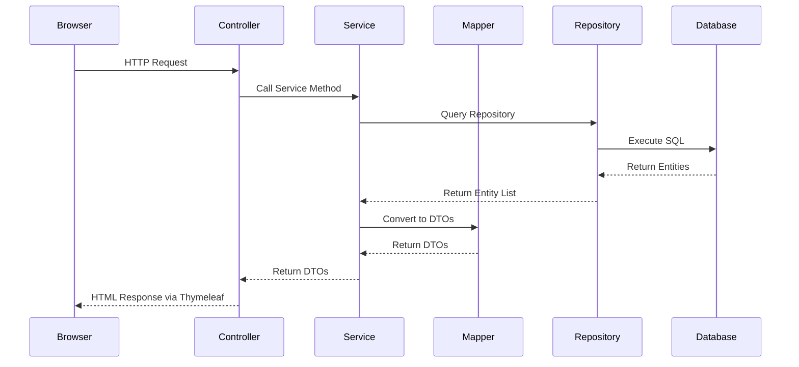
```mermaid
sequenceDiagram
    participant B as Browser
    participant C as Controller
    participant S as Service
    participant M as Mapper
    participant R as Repository
    participant DB as Database
    
    B->>C: HTTP Request
    C->>S: Call Service Method
    S->>R: Query Repository
    R->>DB: Execute SQL
    DB-->>R: Return Entities
    R-->>S: Return Entity List
    S->>M: Convert to DTOs
    M-->>S: Return DTOs
    S-->>C: Return DTOs
    C-->>B: HTML Response via Thymeleaf
```

---

## 4. Project Structure

```
watch-store/
├── pom.xml                                    # Maven configuration
├── db.sql                                     # Database schema & seed data
├── src/
│   └── main/
│       ├── java/com/example/mpds/
│       │   ├── MpdsApplication.java           # Spring Boot entry point
│       │   │
│       │   ├── api/                           # Controllers
│       │   │   ├── ProductAPI.java            # Product endpoints
│       │   │   ├── CartAPI.java               # Cart endpoints
│       │   │   ├── CheckOutAPI.java           # Checkout endpoints
│       │   │   ├── LoginAPI.java              # Login page
│       │   │   ├── RegisterAPI.java           # Registration & OTP
│       │   │   ├── InvoiceAPI.java            # Invoice endpoints
│       │   │   ├── PaymentController.java     # VNPay integration
│       │   │   ├── ErrorController.java       # Error handling
│       │   │   ├── admin/                     # Admin controllers
│       │   │   │   ├── AdminAPI.java          # Dashboard & statistics
│       │   │   │   ├── AdminProduct.java      # Product management
│       │   │   │   ├── AdminBrand.java        # Brand/Category management
│       │   │   │   ├── AdminInvoice.java      # Invoice management
│       │   │   │   ├── AdminUser.java         # User management
│       │   │   │   ├── AdminType.java         # Type management
│       │   │   │   ├── AdminStrap.java        # Strap management
│       │   │   │   └── AdminDialSize.java     # Dial size management
│       │   │   ├── user/                      # User controllers
│       │   │   │   ├── UserProfileAPI.java    # Profile management
│       │   │   │   └── UserUpdatePassword.java # Password recovery
│       │   │   └── output/                    # Response DTOs
│       │   │       ├── CartOutput.java
│       │   │       └── ProductOutput.java
│       │   │
│       │   ├── entity/                        # JPA Entities
│       │   │   ├── BaseEntity.java            # Base class with ID
│       │   │   ├── UserEntity.java
│       │   │   ├── RoleEntity.java
│       │   │   ├── ProductEntity.java
│       │   │   ├── CategoryEntity.java
│       │   │   ├── TypeEntity.java
│       │   │   ├── StrapEntity.java
│       │   │   ├── DialSizeEntity.java
│       │   │   ├── InvoiceEntity.java
│       │   │   ├── InvoiceInfoEntity.java
│       │   │   └── ProductReviewEntity.java
│       │   │
│       │   ├── dto/                           # Data Transfer Objects
│       │   │   ├── AbstractDTO.java
│       │   │   ├── UserDTO.java
│       │   │   ├── ProductDTO.java
│       │   │   ├── CategoryDTO.java
│       │   │   ├── TypeDTO.java
│       │   │   ├── StrapDTO.java
│       │   │   ├── DialSizeDTO.java
│       │   │   ├── InvoiceDTO.java
│       │   │   ├── InvoiceInfoDTO.java
│       │   │   ├── CartDTO.java
│       │   │   └── CartItemDTO.java
│       │   │
│       │   ├── mapper/                        # Entity-DTO Mappers
│       │   │   ├── UserMapper.java
│       │   │   ├── ProductMapper.java
│       │   │   ├── CategoryMapper.java
│       │   │   ├── TypeMapper.java
│       │   │   ├── StrapMapper.java
│       │   │   ├── DialSizeMapper.java
│       │   │   ├── InvoiceMapper.java
│       │   │   └── InvoiceInfoMapper.java
│       │   │
│       │   ├── repository/                    # JPA Repositories
│       │   │   ├── UserRepository.java
│       │   │   ├── RoleRepository.java
│       │   │   ├── ProductRepository.java
│       │   │   ├── CategoryRepository.java
│       │   │   ├── TypeRepository.java
│       │   │   ├── StrapRepository.java
│       │   │   ├── DialSizeRepository.java
│       │   │   ├── InvoiceRepository.java
│       │   │   ├── InvoiceInfoRepository.java
│       │   │   ├── ProductReviewRepository.java
│       │   │   ├── ProductSpecifications.java  # Dynamic queries
│       │   │   └── InvoiceSpecification.java
│       │   │
│       │   ├── services/                      # Service interfaces
│       │   │   ├── IUserService.java
│       │   │   ├── IProductService.java
│       │   │   ├── ICategoryService.java
│       │   │   ├── IInvoiceService.java
│       │   │   └── impl/                      # Service implementations
│       │   │       ├── UserService.java
│       │   │       ├── ProductService.java
│       │   │       ├── CategoryService.java
│       │   │       ├── TypeService.java
│       │   │       ├── StrapService.java
│       │   │       ├── DialSizeService.java
│       │   │       ├── InvoiceService.java
│       │   │       ├── InvoiceInfoService.java
│       │   │       ├── ProductReviewService.java
│       │   │       ├── OTPService.java
│       │   │       ├── EmailService.java
│       │   │       └── FilterProductResult.java
│       │   │
│       │   ├── config/                        # Configuration classes
│       │   │   ├── WebSecurityConfig.java     # Security configuration
│       │   │   ├── CustomAuthenticationProvider.java
│       │   │   ├── CustomUserDetailService.java
│       │   │   ├── CustomAuthenticationSuccessHandler.java
│       │   │   ├── CustomAuthenticationFailHandler.java
│       │   │   ├── PaymentConfig.java         # VNPay configuration
│       │   │   └── CustomDateSerializer.java
│       │   │
│       │   ├── component/                     # Utility components
│       │   │   ├── OTPUtil.java               # OTP generation
│       │   │   └── CartServeletContextListener.java
│       │   │
│       │   └── model/                         # Additional models
│       │       ├── UserInvoiceResult.java
│       │       ├── TotalStatusInvoice.java
│       │       └── TotalProductByType.java
│       │
│       └── resources/
│           ├── application.properties          # App configuration
│           ├── templates/                       # Thymeleaf HTML templates
│           │   ├── index.html                   # Home page
│           │   ├── shop.html                    # Product listing
│           │   ├── detail.html                  # Product detail
│           │   ├── cart.html                    # Shopping cart
│           │   ├── checkout.html                # Checkout page
│           │   ├── login.html                   # Login page
│           │   ├── register.html                # Registration page
│           │   ├── otpconfirm.html              # OTP verification
│           │   ├── userProfile.html             # User profile
│           │   ├── admin.html                   # Admin dashboard
│           │   ├── adminproduct.html            # Product management
│           │   ├── adminbrand.html              # Brand management
│           │   ├── admininvoice.html            # Invoice management
│           │   └── ...
│           └── static/                          # Static resources
│               ├── css/
│               ├── js/
│               ├── img/
│               ├── icons/
│               └── vendor/
```

---

## 5. Database Design

### 5.1 Entity Relationship Diagram (ERD)

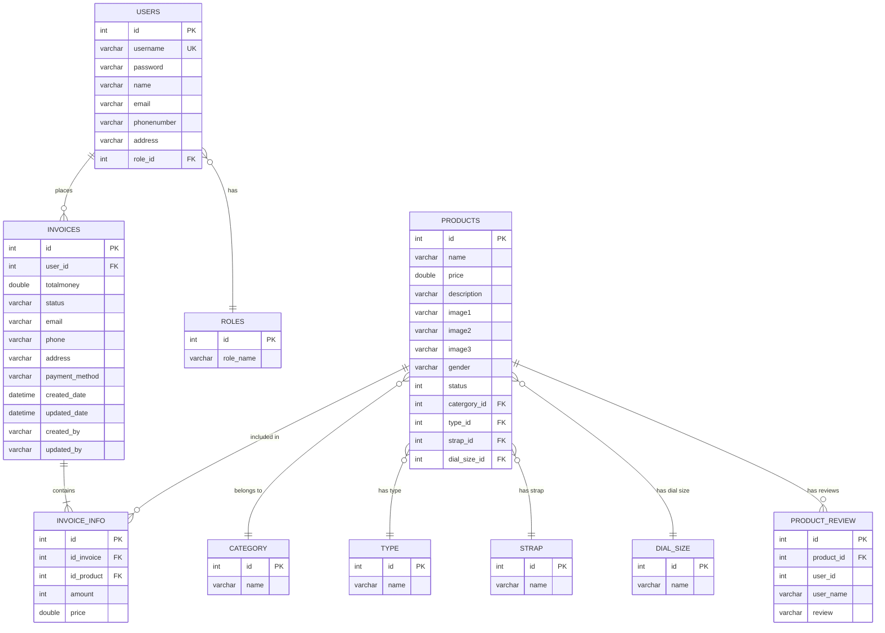
```mermaid
erDiagram
    USERS ||--o{ INVOICES : "places"
    USERS }o--|| ROLES : "has"
    INVOICES ||--|{ INVOICE_INFO : "contains"
    PRODUCTS ||--o{ INVOICE_INFO : "included in"
    PRODUCTS }o--|| CATEGORY : "belongs to"
    PRODUCTS }o--|| TYPE : "has type"
    PRODUCTS }o--|| STRAP : "has strap"
    PRODUCTS }o--|| DIAL_SIZE : "has dial size"
    PRODUCTS ||--o{ PRODUCT_REVIEW : "has reviews"

    USERS {
        int id PK
        varchar username UK
        varchar password
        varchar name
        varchar email
        varchar phonenumber
        varchar address
        int role_id FK
    }

    ROLES {
        int id PK
        varchar role_name
    }

    PRODUCTS {
        int id PK
        varchar name
        double price
        varchar description
        varchar image1
        varchar image2
        varchar image3
        varchar gender
        int status
        int catergory_id FK
        int type_id FK
        int strap_id FK
        int dial_size_id FK
    }

    CATEGORY {
        int id PK
        varchar name
    }

    TYPE {
        int id PK
        varchar name
    }

    STRAP {
        int id PK
        varchar name
    }

    DIAL_SIZE {
        int id PK
        varchar name
    }

    INVOICES {
        int id PK
        int user_id FK
        double totalmoney
        varchar status
        varchar email
        varchar phone
        varchar address
        varchar payment_method
        datetime created_date
        datetime updated_date
        varchar created_by
        varchar updated_by
    }

    INVOICE_INFO {
        int id PK
        int id_invoice FK
        int id_product FK
        int amount
        double price
    }

    PRODUCT_REVIEW {
        int id PK
        int product_id FK
        int user_id
        varchar user_name
        varchar review
    }
```

### 5.2 Database Tables Summary

| Table | Description | Key Columns |
|-------|-------------|-------------|
| `users` | User accounts | id, username, password, email, role_id |
| `roles` | User roles (ADMIN, SELLER, USER) | id, role_name |
| `products` | Watch products catalog | id, name, price, category_id, type_id, strap_id, dial_size_id |
| `category` | Watch brands (Seiko, Fossil, Casio, G-Shock) | id, name |
| `type` | Watch types (Digital, Analogue) | id, name |
| `strap` | Strap materials (Leather, Polyester, Steel) | id, name |
| `dial_size` | Dial sizes (42mm, 45mm, 50mm) | id, name |
| `invoices` | Customer orders | id, user_id, totalmoney, status, payment_method |
| `invoice_info` | Order line items | id, id_invoice, id_product, amount, price |
| `product_review` | Product reviews | id, product_id, user_id, review |

### 5.3 Sample Data

#### Roles
| ID | Role Name |
|----|-----------|
| 0 | USER |
| 1 | ADMIN |
| 2 | SELLER |

#### Categories (Brands)
| ID | Name |
|----|------|
| 1 | Seiko |
| 2 | Fossil |
| 3 | Casio |
| 4 | Gshock |

#### Types
| ID | Name |
|----|------|
| 1 | Digital |
| 2 | Analogue |

#### Straps
| ID | Name |
|----|------|
| 1 | Leather |
| 2 | Polyester |
| 3 | Steel |

#### Dial Sizes
| ID | Name |
|----|------|
| 1 | 42mm |
| 2 | 45mm |
| 3 | 50mm |

---

## 6. Class Diagram

### 6.1 Entity Classes

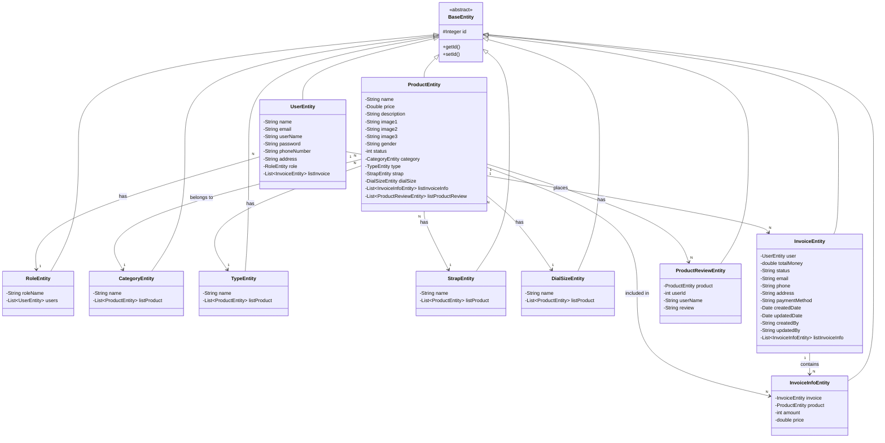
```mermaid
classDiagram
    class BaseEntity {
        <<abstract>>
        #Integer id
        +getId()
        +setId()
    }

    class UserEntity {
        -String name
        -String email
        -String userName
        -String password
        -String phoneNumber
        -String address
        -RoleEntity role
        -List~InvoiceEntity~ listInvoice
    }

    class RoleEntity {
        -String roleName
        -List~UserEntity~ users
    }

    class ProductEntity {
        -String name
        -Double price
        -String description
        -String image1
        -String image2
        -String image3
        -String gender
        -int status
        -CategoryEntity category
        -TypeEntity type
        -StrapEntity strap
        -DialSizeEntity dialSize
        -List~InvoiceInfoEntity~ listInvoiceInfo
        -List~ProductReviewEntity~ listProductReview
    }

    class CategoryEntity {
        -String name
        -List~ProductEntity~ listProduct
    }

    class TypeEntity {
        -String name
        -List~ProductEntity~ listProduct
    }

    class StrapEntity {
        -String name
        -List~ProductEntity~ listProduct
    }

    class DialSizeEntity {
        -String name
        -List~ProductEntity~ listProduct
    }

    class InvoiceEntity {
        -UserEntity user
        -double totalMoney
        -String status
        -String email
        -String phone
        -String address
        -String paymentMethod
        -Date createdDate
        -Date updatedDate
        -String createdBy
        -String updatedBy
        -List~InvoiceInfoEntity~ listInvoiceInfo
    }

    class InvoiceInfoEntity {
        -InvoiceEntity invoice
        -ProductEntity product
        -int amount
        -double price
    }

    class ProductReviewEntity {
        -ProductEntity product
        -int userId
        -String userName
        -String review
    }

    BaseEntity <|-- UserEntity
    BaseEntity <|-- RoleEntity
    BaseEntity <|-- ProductEntity
    BaseEntity <|-- CategoryEntity
    BaseEntity <|-- TypeEntity
    BaseEntity <|-- StrapEntity
    BaseEntity <|-- DialSizeEntity
    BaseEntity <|-- InvoiceEntity
    BaseEntity <|-- InvoiceInfoEntity
    BaseEntity <|-- ProductReviewEntity

    UserEntity "N" --> "1" RoleEntity : has
    UserEntity "1" --> "N" InvoiceEntity : places
    ProductEntity "N" --> "1" CategoryEntity : belongs to
    ProductEntity "N" --> "1" TypeEntity : has
    ProductEntity "N" --> "1" StrapEntity : has
    ProductEntity "N" --> "1" DialSizeEntity : has
    InvoiceEntity "1" --> "N" InvoiceInfoEntity : contains
    ProductEntity "1" --> "N" InvoiceInfoEntity : included in
    ProductEntity "1" --> "N" ProductReviewEntity : has
```

### 6.2 Service Classes

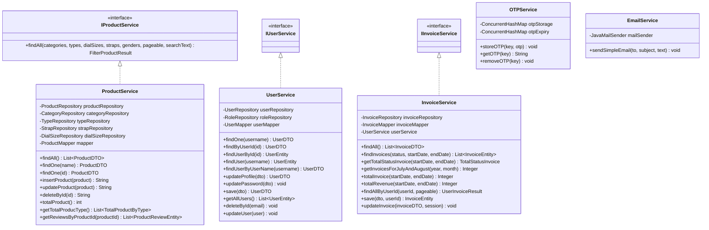
```mermaid
classDiagram
    class IProductService {
        <<interface>>
        +findAll(categories, types, dialSizes, straps, genders, pageable, searchText) FilterProductResult
    }

    class ProductService {
        -ProductRepository productRepository
        -CategoryRepository categoryRepository
        -TypeRepository typeRepository
        -StrapRepository strapRepository
        -DialSizeRepository dialSizeRepository
        -ProductMapper mapper
        +findAll() List~ProductDTO~
        +findOne(name) ProductDTO
        +findOne(id) ProductDTO
        +insertProduct(product) String
        +updateProduct(product) String
        +deleteById(id) String
        +totalProduct() int
        +getTotalProducType() List~TotalProductByType~
        +getReviewsByProductId(productId) List~ProductReviewEntity~
    }

    class IUserService {
        <<interface>>
    }

    class UserService {
        -UserRepository userRepository
        -RoleRepository roleRepository
        -UserMapper userMapper
        +findOne(username) UserDTO
        +findByUserId(id) UserDTO
        +findUserById(id) UserEntity
        +findUser(username) UserEntity
        +findUserByUserName(username) UserDTO
        +updateProfile(dto) UserDTO
        +updatePassword(dto) void
        +save(dto) UserDTO
        +getAllUsers() List~UserEntity~
        +deleteById(email) void
        +updateUser(user) void
    }

    class IInvoiceService {
        <<interface>>
    }

    class InvoiceService {
        -InvoiceRepository invoiceRepository
        -InvoiceMapper invoiceMapper
        -UserService userService
        +findAll() List~InvoiceDTO~
        +findInvoices(status, startDate, endDate) List~InvoiceEntity~
        +getTotalStatusInvoice(startDate, endDate) TotalStatusInvoice
        +getInvoicesForJulyAndAugust(year, month) Integer
        +totalInvoice(startDate, endDate) Integer
        +totalRevenue(startDate, endDate) Integer
        +findAllByUserId(userId, pageable) UserInvoiceResult
        +save(dto, userId) InvoiceEntity
        +updateInvoice(invoiceDTO, session) void
    }

    class OTPService {
        -ConcurrentHashMap otpStorage
        -ConcurrentHashMap otpExpiry
        +storeOTP(key, otp) void
        +getOTP(key) String
        +removeOTP(key) void
    }

    class EmailService {
        -JavaMailSender mailSender
        +sendSimpleEmail(to, subject, text) void
    }

    IProductService <|.. ProductService
    IUserService <|.. UserService
    IInvoiceService <|.. InvoiceService
```

### 6.3 Controller Classes


```mermaid
classDiagram
    class ProductAPI {
        -ProductService productService
        -CategoryService categoryService
        -TypeService typeService
        -StrapService strapService
        -DialSizeService dialSizeService
        +shop(page, sort, categories, types, dialSizes, straps, genders, searchText, model) String
        +detailProduct(name, model) String
    }

    class CartAPI {
        -ProductService productService
        +addProduct(id, quantity, session) ResponseEntity~CartOutput~
        +changeQuantityItem(id, quantity, change, session) ResponseEntity~CartOutput~
        +removeItem(id, session) String
        +getCart(model) String
    }

    class CheckOutAPI {
        -InvoiceService invoiceService
        -InvoiceInfoService invoiceInfoService
        +showCheckOutPage() String
        +saveInvoice(total, phone, address, email, status, vnPayChecked, model, session, redirectAttributes) String
    }

    class RegisterAPI {
        -UserService userService
        -OTPService otpService
        -EmailService emailService
        +regisPage() String
        +register(name, email, userName, password, otp, model) RedirectView
        +generateOTP(name, email, userName, password, permission, model) String
    }

    class AdminAPI {
        -ProductService productService
        -InvoiceService invoiceService
        +getStatistics(startDate, endDate, model) String
    }

    class AdminProduct {
        -ProductService productService
        -ProductMapper productMapper
        +getUser(model) String
        +deleteProductById(id) ResponseEntity~String~
        +insertProduct(product) ResponseEntity~String~
        +updateProduct(product) ResponseEntity~String~
    }

    class UserProfileAPI {
        -UserService userService
        -InvoiceService invoiceService
        +loginPage(model, session) String
        +getInvoices(page, userId) Map~String Object~
        +changePassword(oldPassword, newPassword, confirmPassword, userId) ResponseEntity
        +updateUserProfile(userDTO) ResponseEntity~UserDTO~
    }

    class PaymentController {
        +createPayment(request, entity, model) RedirectView
    }
```

---

## 7. Use Case Diagram

### 7.1 Overall System Use Cases

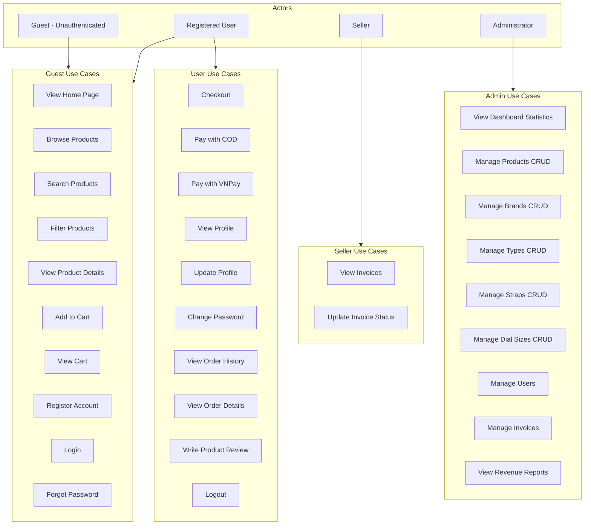
```mermaid
flowchart TB
    subgraph Actors
        Guest["Guest - Unauthenticated"]
        User["Registered User"]
        Seller["Seller"]
        Admin["Administrator"]
    end

    subgraph GuestUseCases["Guest Use Cases"]
        UC1["View Home Page"]
        UC2["Browse Products"]
        UC3["Search Products"]
        UC4["Filter Products"]
        UC5["View Product Details"]
        UC6["Add to Cart"]
        UC7["View Cart"]
        UC8["Register Account"]
        UC9["Login"]
        UC10["Forgot Password"]
    end

    subgraph UserUseCases["User Use Cases"]
        UC11["Checkout"]
        UC12["Pay with COD"]
        UC13["Pay with VNPay"]
        UC14["View Profile"]
        UC15["Update Profile"]
        UC16["Change Password"]
        UC17["View Order History"]
        UC18["View Order Details"]
        UC19["Write Product Review"]
        UC20["Logout"]
    end

    subgraph SellerUseCases["Seller Use Cases"]
        UC21["View Invoices"]
        UC22["Update Invoice Status"]
    end

    subgraph AdminUseCases["Admin Use Cases"]
        UC23["View Dashboard Statistics"]
        UC24["Manage Products CRUD"]
        UC25["Manage Brands CRUD"]
        UC26["Manage Types CRUD"]
        UC27["Manage Straps CRUD"]
        UC28["Manage Dial Sizes CRUD"]
        UC29["Manage Users"]
        UC30["Manage Invoices"]
        UC31["View Revenue Reports"]
    end

    Guest --> GuestUseCases
    User --> GuestUseCases
    User --> UserUseCases
    Seller --> SellerUseCases
    Admin --> AdminUseCases
```

### 7.2 Authentication Use Cases

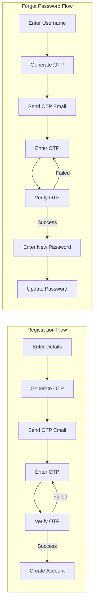
```mermaid
flowchart LR
    subgraph Registration["Registration Flow"]
        R1["Enter Details"] --> R2["Generate OTP"]
        R2 --> R3["Send OTP Email"]
        R3 --> R4["Enter OTP"]
        R4 --> R5["Verify OTP"]
        R5 -->|Success| R6["Create Account"]
        R5 -->|Failed| R4
    end

    subgraph ForgotPassword["Forgot Password Flow"]
        F1["Enter Username"] --> F2["Generate OTP"]
        F2 --> F3["Send OTP Email"]
        F3 --> F4["Enter OTP"]
        F4 --> F5["Verify OTP"]
        F5 -->|Success| F6["Enter New Password"]
        F6 --> F7["Update Password"]
        F5 -->|Failed| F4
    end
```

---

## 8. Sequence Diagrams

### 8.1 User Registration Flow

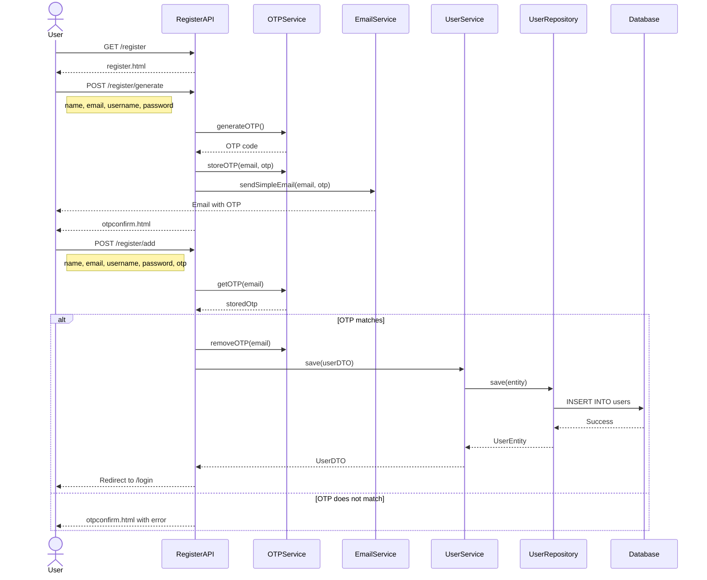
```mermaid
sequenceDiagram
    actor User
    participant RegisterAPI
    participant OTPService
    participant EmailService
    participant UserService
    participant UserRepository
    participant DB as Database

    User->>RegisterAPI: GET /register
    RegisterAPI-->>User: register.html

    User->>RegisterAPI: POST /register/generate
    Note right of User: name, email, username, password
    RegisterAPI->>OTPService: generateOTP()
    OTPService-->>RegisterAPI: OTP code
    RegisterAPI->>OTPService: storeOTP(email, otp)
    RegisterAPI->>EmailService: sendSimpleEmail(email, otp)
    EmailService-->>User: Email with OTP
    RegisterAPI-->>User: otpconfirm.html

    User->>RegisterAPI: POST /register/add
    Note right of User: name, email, username, password, otp
    RegisterAPI->>OTPService: getOTP(email)
    OTPService-->>RegisterAPI: storedOtp

    alt OTP matches
        RegisterAPI->>OTPService: removeOTP(email)
        RegisterAPI->>UserService: save(userDTO)
        UserService->>UserRepository: save(entity)
        UserRepository->>DB: INSERT INTO users
        DB-->>UserRepository: Success
        UserRepository-->>UserService: UserEntity
        UserService-->>RegisterAPI: UserDTO
        RegisterAPI-->>User: Redirect to /login
    else OTP does not match
        RegisterAPI-->>User: otpconfirm.html with error
    end
```

### 8.2 User Login Flow

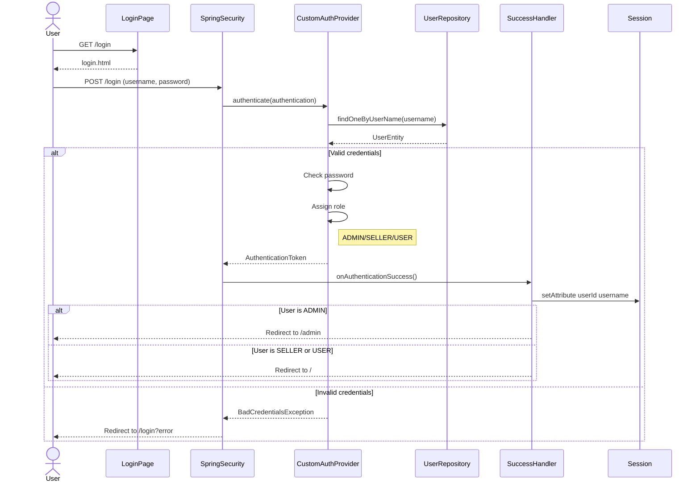
```mermaid
sequenceDiagram
    actor User
    participant LoginPage
    participant SpringSecurity
    participant CustomAuthProvider
    participant UserRepository
    participant SuccessHandler
    participant Session

    User->>LoginPage: GET /login
    LoginPage-->>User: login.html

    User->>SpringSecurity: POST /login (username, password)
    SpringSecurity->>CustomAuthProvider: authenticate(authentication)
    CustomAuthProvider->>UserRepository: findOneByUserName(username)
    UserRepository-->>CustomAuthProvider: UserEntity

    alt Valid credentials
        CustomAuthProvider->>CustomAuthProvider: Check password
        CustomAuthProvider->>CustomAuthProvider: Assign role
        Note right of CustomAuthProvider: ADMIN/SELLER/USER
        CustomAuthProvider-->>SpringSecurity: AuthenticationToken
        SpringSecurity->>SuccessHandler: onAuthenticationSuccess()
        SuccessHandler->>Session: setAttribute userId username
        
        alt User is ADMIN
            SuccessHandler-->>User: Redirect to /admin
        else User is SELLER or USER
            SuccessHandler-->>User: Redirect to /
        end
    else Invalid credentials
        CustomAuthProvider-->>SpringSecurity: BadCredentialsException
        SpringSecurity-->>User: Redirect to /login?error
    end
```

### 8.3 Shopping Cart Flow

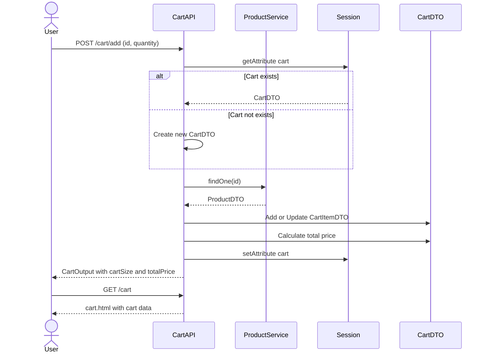
```mermaid
sequenceDiagram
    actor User
    participant CartAPI
    participant ProductService
    participant Session
    participant CartDTO

    User->>CartAPI: POST /cart/add (id, quantity)
    CartAPI->>Session: getAttribute cart
    
    alt Cart exists
        Session-->>CartAPI: CartDTO
    else Cart not exists
        CartAPI->>CartAPI: Create new CartDTO
    end

    CartAPI->>ProductService: findOne(id)
    ProductService-->>CartAPI: ProductDTO

    CartAPI->>CartDTO: Add or Update CartItemDTO
    CartAPI->>CartDTO: Calculate total price
    CartAPI->>Session: setAttribute cart
    CartAPI-->>User: CartOutput with cartSize and totalPrice

    User->>CartAPI: GET /cart
    CartAPI-->>User: cart.html with cart data
```

### 8.4 Checkout Flow

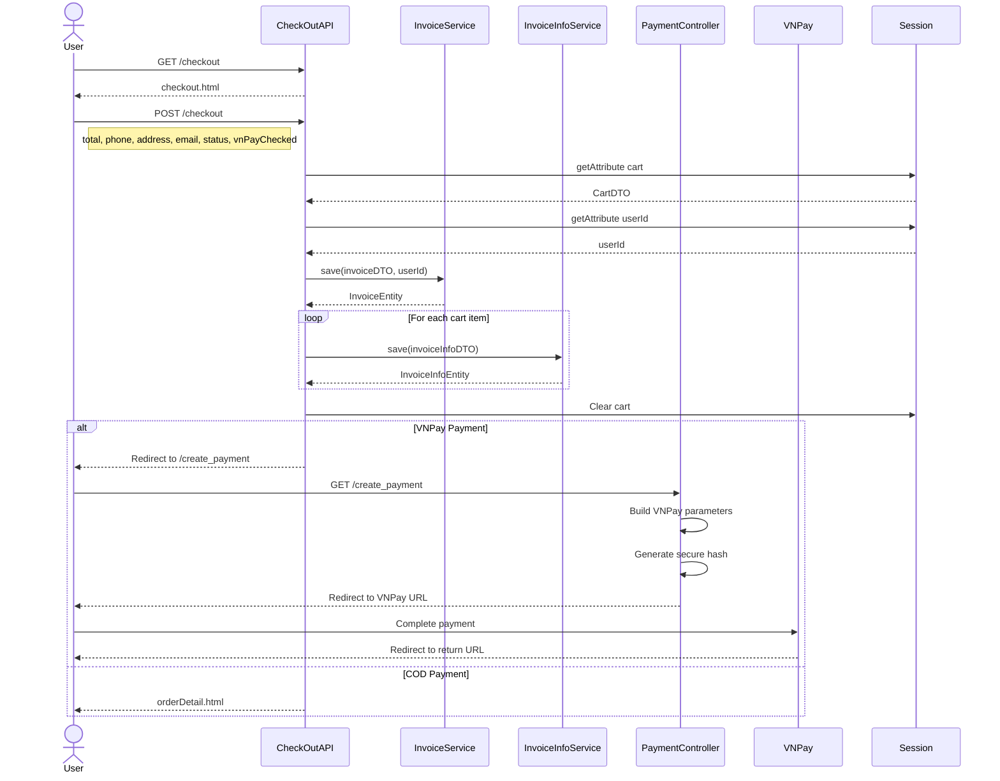
```mermaid
sequenceDiagram
    actor User
    participant CheckOutAPI
    participant InvoiceService
    participant InvoiceInfoService
    participant PaymentController
    participant VNPay
    participant Session

    User->>CheckOutAPI: GET /checkout
    CheckOutAPI-->>User: checkout.html

    User->>CheckOutAPI: POST /checkout
    Note right of User: total, phone, address, email, status, vnPayChecked
    CheckOutAPI->>Session: getAttribute cart
    Session-->>CheckOutAPI: CartDTO
    CheckOutAPI->>Session: getAttribute userId
    Session-->>CheckOutAPI: userId

    CheckOutAPI->>InvoiceService: save(invoiceDTO, userId)
    InvoiceService-->>CheckOutAPI: InvoiceEntity

    loop For each cart item
        CheckOutAPI->>InvoiceInfoService: save(invoiceInfoDTO)
        InvoiceInfoService-->>CheckOutAPI: InvoiceInfoEntity
    end

    CheckOutAPI->>Session: Clear cart

    alt VNPay Payment
        CheckOutAPI-->>User: Redirect to /create_payment
        User->>PaymentController: GET /create_payment
        PaymentController->>PaymentController: Build VNPay parameters
        PaymentController->>PaymentController: Generate secure hash
        PaymentController-->>User: Redirect to VNPay URL
        User->>VNPay: Complete payment
        VNPay-->>User: Redirect to return URL
    else COD Payment
        CheckOutAPI-->>User: orderDetail.html
    end
```

### 8.5 Admin Product Management Flow

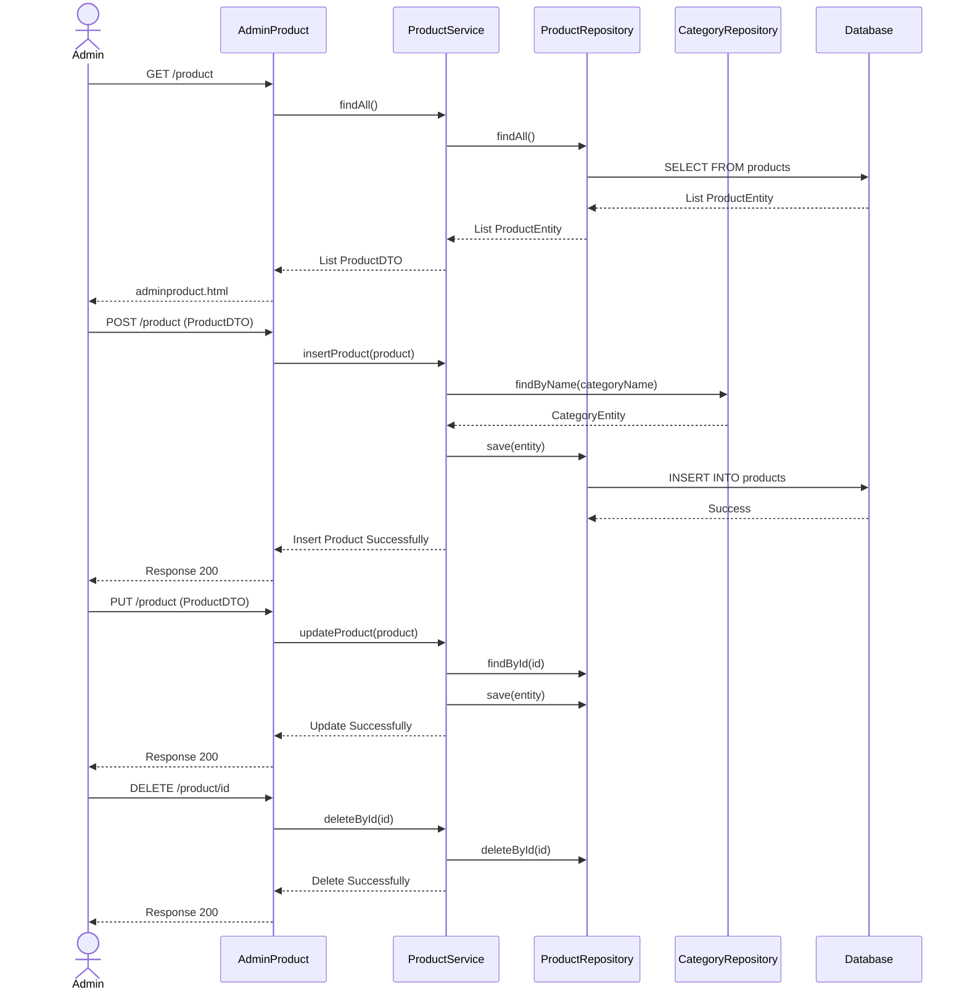
```mermaid
sequenceDiagram
    actor Admin
    participant AdminProduct
    participant ProductService
    participant ProductRepository
    participant CategoryRepository
    participant DB as Database

    Admin->>AdminProduct: GET /product
    AdminProduct->>ProductService: findAll()
    ProductService->>ProductRepository: findAll()
    ProductRepository->>DB: SELECT FROM products
    DB-->>ProductRepository: List ProductEntity
    ProductRepository-->>ProductService: List ProductEntity
    ProductService-->>AdminProduct: List ProductDTO
    AdminProduct-->>Admin: adminproduct.html

    Admin->>AdminProduct: POST /product (ProductDTO)
    AdminProduct->>ProductService: insertProduct(product)
    ProductService->>CategoryRepository: findByName(categoryName)
    CategoryRepository-->>ProductService: CategoryEntity
    ProductService->>ProductRepository: save(entity)
    ProductRepository->>DB: INSERT INTO products
    DB-->>ProductRepository: Success
    ProductService-->>AdminProduct: Insert Product Successfully
    AdminProduct-->>Admin: Response 200

    Admin->>AdminProduct: PUT /product (ProductDTO)
    AdminProduct->>ProductService: updateProduct(product)
    ProductService->>ProductRepository: findById(id)
    ProductService->>ProductRepository: save(entity)
    ProductService-->>AdminProduct: Update Successfully
    AdminProduct-->>Admin: Response 200

    Admin->>AdminProduct: DELETE /product/id
    AdminProduct->>ProductService: deleteById(id)
    ProductService->>ProductRepository: deleteById(id)
    ProductService-->>AdminProduct: Delete Successfully
    AdminProduct-->>Admin: Response 200
```

### 8.6 Password Recovery Flow

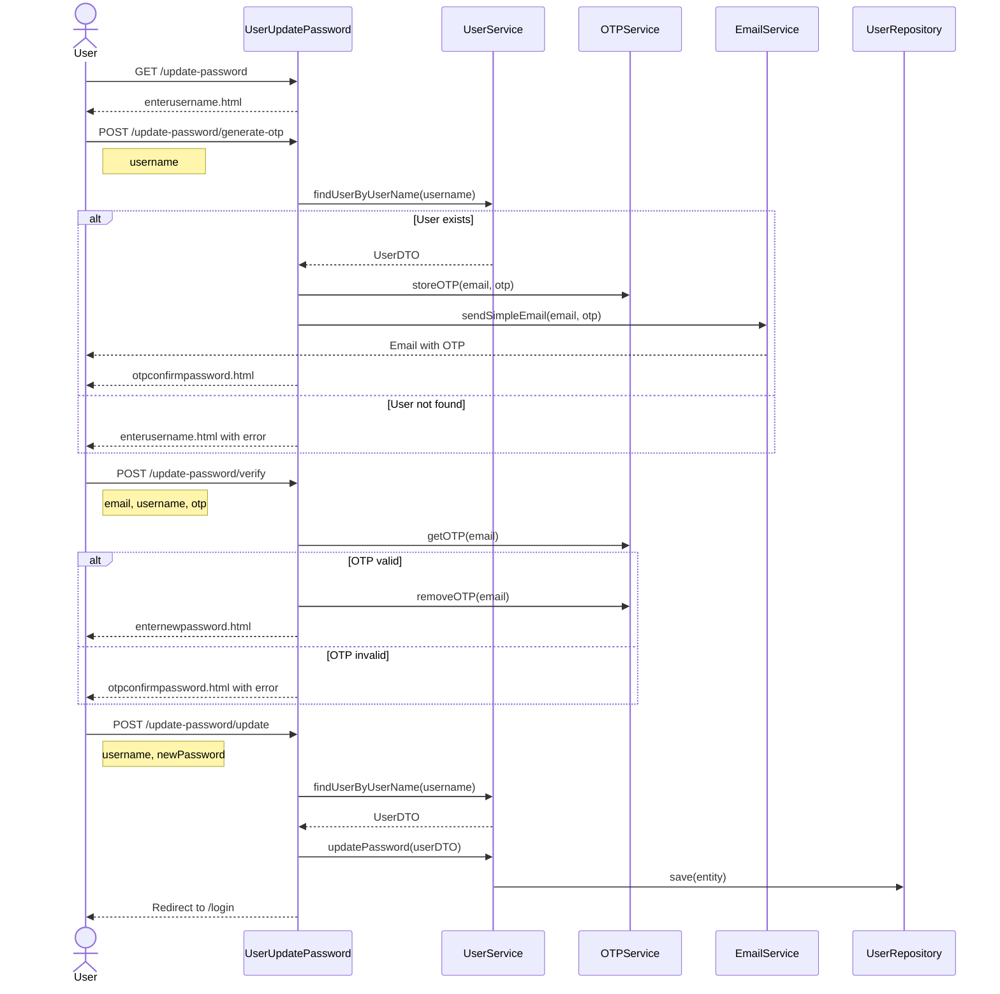
```mermaid
sequenceDiagram
    actor User
    participant UserUpdatePassword
    participant UserService
    participant OTPService
    participant EmailService
    participant UserRepository

    User->>UserUpdatePassword: GET /update-password
    UserUpdatePassword-->>User: enterusername.html

    User->>UserUpdatePassword: POST /update-password/generate-otp
    Note right of User: username
    UserUpdatePassword->>UserService: findUserByUserName(username)
    
    alt User exists
        UserService-->>UserUpdatePassword: UserDTO
        UserUpdatePassword->>OTPService: storeOTP(email, otp)
        UserUpdatePassword->>EmailService: sendSimpleEmail(email, otp)
        EmailService-->>User: Email with OTP
        UserUpdatePassword-->>User: otpconfirmpassword.html
    else User not found
        UserUpdatePassword-->>User: enterusername.html with error
    end

    User->>UserUpdatePassword: POST /update-password/verify
    Note right of User: email, username, otp
    UserUpdatePassword->>OTPService: getOTP(email)
    
    alt OTP valid
        UserUpdatePassword->>OTPService: removeOTP(email)
        UserUpdatePassword-->>User: enternewpassword.html
    else OTP invalid
        UserUpdatePassword-->>User: otpconfirmpassword.html with error
    end

    User->>UserUpdatePassword: POST /update-password/update
    Note right of User: username, newPassword
    UserUpdatePassword->>UserService: findUserByUserName(username)
    UserService-->>UserUpdatePassword: UserDTO
    UserUpdatePassword->>UserService: updatePassword(userDTO)
    UserService->>UserRepository: save(entity)
    UserUpdatePassword-->>User: Redirect to /login
```

---

## 9. Component Diagram

### 9.1 System Components

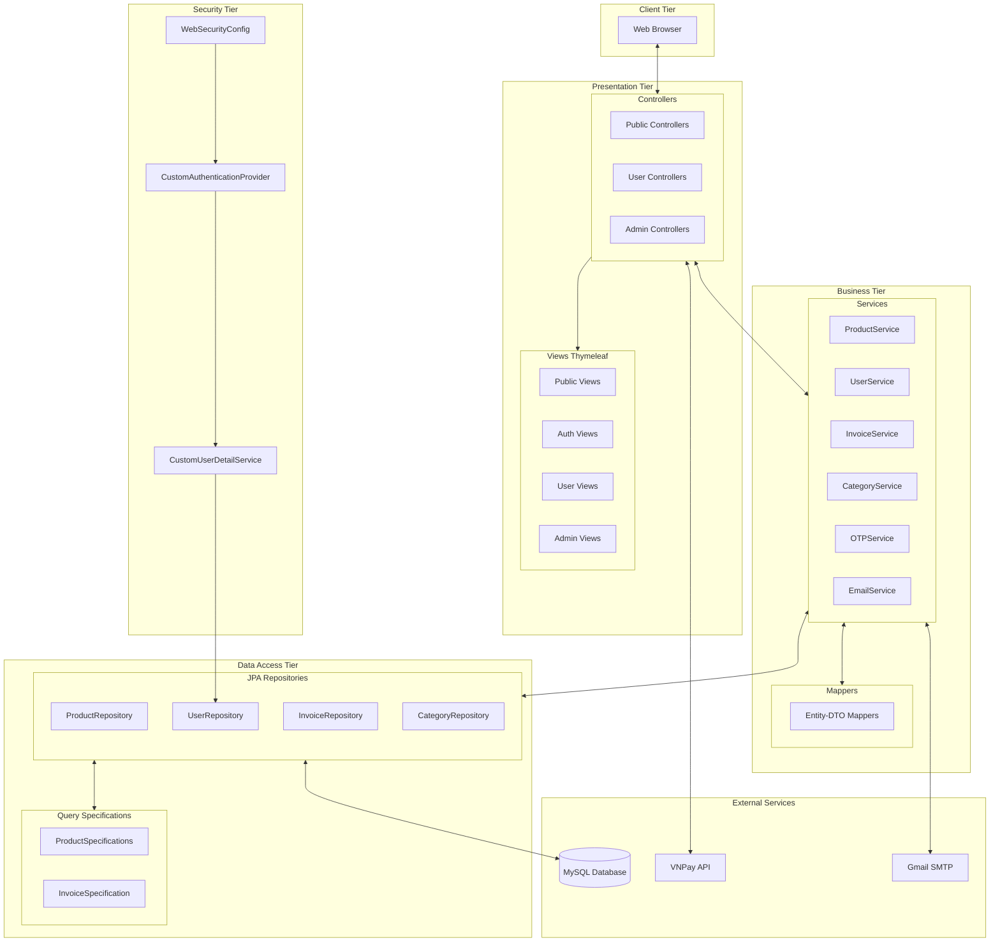
```mermaid
flowchart TB
    subgraph ClientTier["Client Tier"]
        Browser["Web Browser"]
    end

    subgraph PresentationTier["Presentation Tier"]
        subgraph Controllers["Controllers"]
            PublicControllers["Public Controllers"]
            UserControllers["User Controllers"]
            AdminControllers["Admin Controllers"]
        end
        
        subgraph Views["Views Thymeleaf"]
            PublicViews["Public Views"]
            AuthViews["Auth Views"]
            UserViews["User Views"]
            AdminViews["Admin Views"]
        end
    end

    subgraph BusinessTier["Business Tier"]
        subgraph Services["Services"]
            ProductService["ProductService"]
            UserService["UserService"]
            InvoiceService["InvoiceService"]
            CategoryService["CategoryService"]
            OTPService["OTPService"]
            EmailService["EmailService"]
        end

        subgraph Mappers["Mappers"]
            EntityMappers["Entity-DTO Mappers"]
        end
    end

    subgraph DataTier["Data Access Tier"]
        subgraph Repositories["JPA Repositories"]
            ProductRepo["ProductRepository"]
            UserRepo["UserRepository"]
            InvoiceRepo["InvoiceRepository"]
            CategoryRepo["CategoryRepository"]
        end

        subgraph Specifications["Query Specifications"]
            ProductSpec["ProductSpecifications"]
            InvoiceSpec["InvoiceSpecification"]
        end
    end

    subgraph SecurityTier["Security Tier"]
        SecurityConfig["WebSecurityConfig"]
        AuthProvider["CustomAuthenticationProvider"]
        UserDetailService["CustomUserDetailService"]
    end

    subgraph ExternalTier["External Services"]
        MySQL[("MySQL Database")]
        VNPay["VNPay API"]
        SMTP["Gmail SMTP"]
    end

    Browser <--> Controllers
    Controllers --> Views
    Controllers <--> Services
    Services <--> Mappers
    Services <--> Repositories
    Repositories <--> Specifications
    Repositories <--> MySQL
    Controllers <--> VNPay
    Services <--> SMTP
    SecurityConfig --> AuthProvider
    AuthProvider --> UserDetailService
    UserDetailService --> UserRepo
```

### 9.2 Module Dependencies


```mermaid
flowchart LR
    subgraph API["API Module"]
        ProductAPI
        CartAPI
        CheckOutAPI
        RegisterAPI
        AdminAPI
        UserProfileAPI
    end

    subgraph Service["Service Module"]
        ProductService
        UserService
        InvoiceService
        CategoryService
        OTPService
        EmailService
    end

    subgraph Repository["Repository Module"]
        ProductRepository
        UserRepository
        InvoiceRepository
        CategoryRepository
    end

    subgraph Entity["Entity Module"]
        ProductEntity
        UserEntity
        InvoiceEntity
        CategoryEntity
    end

    subgraph DTO["DTO Module"]
        ProductDTO
        UserDTO
        InvoiceDTO
        CategoryDTO
    end

    subgraph Mapper["Mapper Module"]
        ProductMapper
        UserMapper
        InvoiceMapper
    end

    API --> Service
    Service --> Repository
    Service --> Mapper
    Repository --> Entity
    Mapper --> Entity
    Mapper --> DTO
    API --> DTO
```

---

## 10. API Documentation

### 10.1 Public Endpoints (No Authentication Required)

| Method | Endpoint | Controller | Description | Parameters |
|--------|----------|------------|-------------|------------|
| GET | `/` | - | Home page | - |
| GET | `/login` | LoginAPI | Login page | - |
| GET | `/register` | RegisterAPI | Registration page | - |
| POST | `/register/generate` | RegisterAPI | Generate OTP for registration | name, email, userName, password, permission |
| POST | `/register/add` | RegisterAPI | Complete registration | name, email, userName, password, otp |
| GET | `/shop` | ProductAPI | Product listing with filters | page, sort, category[], type[], dialSize[], strap[], gender[], searchText |
| GET | `/detail` | ProductAPI | Product detail page | name |
| GET | `/cart` | CartAPI | View cart | - |
| POST | `/cart/add` | CartAPI | Add product to cart | id, quantity |
| POST | `/cart/amount` | CartAPI | Update cart item quantity | id, quantity, change (inc/dec) |
| DELETE | `/cart/remove` | CartAPI | Remove item from cart | id |
| GET | `/update-password` | UserUpdatePassword | Forgot password page | - |
| POST | `/update-password/generate-otp` | UserUpdatePassword | Generate OTP for password reset | username |
| POST | `/update-password/verify` | UserUpdatePassword | Verify OTP | email, username, otp |
| POST | `/update-password/update` | UserUpdatePassword | Update password | username, newPassword |
| GET | `/error` | ErrorController | Error page | - |

### 10.2 User Endpoints (Authenticated Users)

| Method | Endpoint | Controller | Description | Parameters |
|--------|----------|------------|-------------|------------|
| GET | `/checkout` | CheckOutAPI | Checkout page | - |
| POST | `/checkout` | CheckOutAPI | Process checkout | totalMoney, phone, address, email, status, vnPayChecked |
| GET | `/create_payment` | PaymentController | VNPay payment redirect | totalMoney |
| GET | `/profile` | UserProfileAPI | User profile page | - |
| POST | `/profile` | UserProfileAPI | Update user profile | UserDTO (JSON body) |
| GET | `/profile/{userId}/invoices` | UserProfileAPI | Get user invoices (paginated) | page |
| POST | `/profile/changepassword` | UserProfileAPI | Change password | oldPassword, newPassword, confirmPassword, userId |
| GET | `/profile/invoice/{id}` | InvoiceAPI | View invoice details | id |
| POST | `/review` | InvoiceAPI | Add product review | Review (JSON body) |

### 10.3 Seller Endpoints (ROLE_SELLER or ROLE_ADMIN)

| Method | Endpoint | Controller | Description | Parameters |
|--------|----------|------------|-------------|------------|
| GET | `/invoice` | AdminInvoice | View all invoices | - |
| PUT | `/invoice` | AdminInvoice | Update invoice | InvoiceDTO (JSON body) |

### 10.4 Admin Endpoints (ROLE_ADMIN Only)

#### Dashboard and Statistics
| Method | Endpoint | Controller | Description | Parameters |
|--------|----------|------------|-------------|------------|
| GET | `/admin` | AdminAPI | Admin dashboard with statistics | startDate?, endDate? |

#### Product Management
| Method | Endpoint | Controller | Description | Request Body |
|--------|----------|------------|-------------|--------------|
| GET | `/product` | AdminProduct | List all products | - |
| POST | `/product` | AdminProduct | Create new product | ProductDTO |
| PUT | `/product` | AdminProduct | Update product | ProductDTO |
| DELETE | `/product/{id}` | AdminProduct | Delete product | - |

#### Brand/Category Management
| Method | Endpoint | Controller | Description | Request Body |
|--------|----------|------------|-------------|--------------|
| GET | `/brand` | AdminBrand | List all brands | - |
| POST | `/brand` | AdminBrand | Create new brand | CategoryDTO |
| PUT | `/brand` | AdminBrand | Update brand | CategoryDTO |
| DELETE | `/brand/{id}` | AdminBrand | Delete brand | - |

#### Type Management
| Method | Endpoint | Controller | Description | Request Body |
|--------|----------|------------|-------------|--------------|
| GET | `/type` | AdminType | List all types | - |
| POST | `/type` | AdminType | Create new type | TypeDTO |
| PUT | `/type` | AdminType | Update type | TypeDTO |
| DELETE | `/type/{id}` | AdminType | Delete type | - |

#### Strap Management
| Method | Endpoint | Controller | Description | Request Body |
|--------|----------|------------|-------------|--------------|
| GET | `/strap` | AdminStrap | List all straps | - |
| POST | `/strap` | AdminStrap | Create new strap | StrapDTO |
| PUT | `/strap` | AdminStrap | Update strap | StrapDTO |
| DELETE | `/strap/{id}` | AdminStrap | Delete strap | - |

#### Dial Size Management
| Method | Endpoint | Controller | Description | Request Body |
|--------|----------|------------|-------------|--------------|
| GET | `/dialsize` | AdminDialSize | List all dial sizes | - |
| POST | `/dialsize` | AdminDialSize | Create new dial size | DialSizeDTO |
| PUT | `/dialsize` | AdminDialSize | Update dial size | DialSizeDTO |
| DELETE | `/dialsize/{id}` | AdminDialSize | Delete dial size | - |

#### User Management
| Method | Endpoint | Controller | Description | Request Body |
|--------|----------|------------|-------------|--------------|
| GET | `/users` | AdminUser | List all users | - |
| PUT | `/users` | AdminUser | Update user | UpdateUserRequest |
| DELETE | `/users/{email}` | AdminUser | Delete user by email | - |

### 10.5 API Request/Response Examples

#### Add to Cart
```http
POST /cart/add
Content-Type: application/x-www-form-urlencoded

id=5&quantity=2
```

Response:
```json
{
  "cartSize": 3,
  "totalPriceOfCart": 450.0
}
```

#### Create Product (Admin)
```http
POST /product
Content-Type: application/json

{
  "name": "Seiko Presage",
  "price": 350.0,
  "categoryName": "Seiko",
  "type": "Analogue",
  "strap": "Leather",
  "dialSize": "42mm",
  "gender": "Male",
  "description": "Classic dress watch",
  "image1": "https://example.com/image1.jpg",
  "image2": "https://example.com/image2.jpg",
  "image3": "https://example.com/image3.jpg",
  "status": 1
}
```

Response:
```
"Insert Product Successfully"
```

#### Add Review
```http
POST /review
Content-Type: application/json

{
  "productId": 5,
  "userId": 2,
  "userName": "john_doe",
  "review": "Excellent watch, highly recommended!"
}
```

---

## 11. Security Configuration

### 11.1 Spring Security Setup

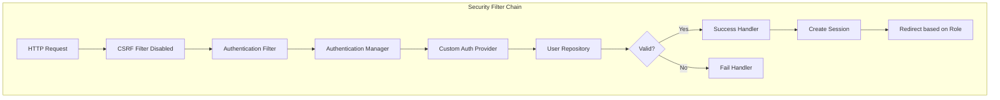
```mermaid
flowchart TB
    subgraph SecurityFlow["Security Filter Chain"]
        Request["HTTP Request"] --> CSRFFilter["CSRF Filter Disabled"]
        CSRFFilter --> AuthFilter["Authentication Filter"]
        AuthFilter --> AuthManager["Authentication Manager"]
        AuthManager --> CustomAuthProvider["Custom Auth Provider"]
        CustomAuthProvider --> UserRepo["User Repository"]
        UserRepo --> Decision{Valid?}
        Decision -->|Yes| SuccessHandler["Success Handler"]
        Decision -->|No| FailHandler["Fail Handler"]
        SuccessHandler --> Session["Create Session"]
        Session --> Redirect["Redirect based on Role"]
    end
```

### 11.2 Access Control Matrix

| Endpoint Pattern | Guest | USER | SELLER | ADMIN |
|------------------|-------|------|--------|-------|
| `/`, `/shop`, `/detail/**` | Yes | Yes | Yes | No |
| `/cart/**` | Yes | Yes | Yes | No |
| `/login`, `/register/**` | Yes | Yes | Yes | No |
| `/checkout/**` | No | Yes | Yes | No |
| `/profile/**` | No | Yes | Yes | Yes |
| `/invoice` | No | No | Yes | Yes |
| `/admin` | No | No | No | Yes |
| `/product/**` | No | No | No | Yes |
| `/brand/**` | No | No | No | Yes |
| `/type/**` | No | No | No | Yes |
| `/strap/**` | No | No | No | Yes |
| `/dialsize/**` | No | No | No | Yes |
| `/users/**` | No | No | No | Yes |

### 11.3 Role Hierarchy

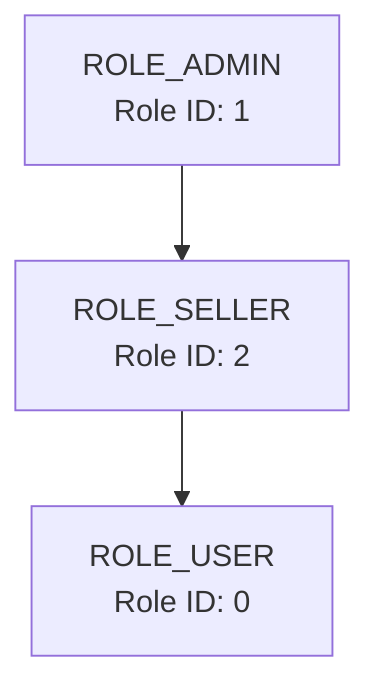
```mermaid
flowchart TB
    ADMIN["ROLE_ADMIN\nRole ID: 1"]
    SELLER["ROLE_SELLER\nRole ID: 2"]
    USER["ROLE_USER\nRole ID: 0"]
    
    ADMIN --> SELLER
    SELLER --> USER
```

### 11.4 Authentication Flow

1. **Form Login**: Users submit credentials to `/login`
2. **Custom Authentication Provider**: Validates credentials against database
3. **Role Assignment**: Based on `role_id` in users table
4. **Session Management**: User ID and username stored in HTTP session
5. **Success Handler**: Redirects to `/admin` for admins, `/` for others

---

## 12. Installation Guide

### 12.1 Prerequisites

- Java JDK 17 or higher
- Maven 3.6 or higher
- MySQL 8.x
- IDE (IntelliJ IDEA, Eclipse, VS Code)

### 12.2 Database Setup

1. Create MySQL database:
```sql
CREATE DATABASE ecommerce;
```

2. Import schema and sample data:
```bash
mysql -u root -p ecommerce < db.sql
```

### 12.3 Application Configuration

Update `src/main/resources/application.properties`:

```properties
# Server Port
server.port=8081

# Database Configuration
spring.datasource.driver-class-name=com.mysql.cj.jdbc.Driver
spring.datasource.url=jdbc:mysql://localhost:3306/ecommerce
spring.datasource.username=your_username
spring.datasource.password=your_password

# JPA Configuration
spring.jpa.hibernate.ddl-auto=update
spring.jpa.properties.hibernate.dialect=org.hibernate.dialect.MySQL8Dialect

# Thymeleaf Configuration
spring.thymeleaf.prefix=classpath:/templates/
spring.thymeleaf.suffix=.html

# Email Configuration (for OTP)
spring.mail.host=smtp.gmail.com
spring.mail.port=587
spring.mail.username=your_email@gmail.com
spring.mail.password=your_app_password
spring.mail.properties.mail.smtp.auth=true
spring.mail.properties.mail.smtp.starttls.enable=true
```

### 12.4 VNPay Configuration

Update `src/main/java/com/example/mpds/config/PaymentConfig.java`:

```java
public static String vnp_ReturnUrl = "http://localhost:8081/";
public static String vnp_TmnCode = "YOUR_TERMINAL_CODE";
public static String secretKey = "YOUR_SECRET_KEY";
```

### 12.5 Build and Run

```bash
# Clone the repository
git clone <repository-url>
cd watch-store

# Build the project
mvn clean install

# Run the application
mvn spring-boot:run
```

### 12.6 Access the Application

| URL | Description |
|-----|-------------|
| http://localhost:8081/ | Home page |
| http://localhost:8081/shop | Product catalog |
| http://localhost:8081/login | Login page |
| http://localhost:8081/admin | Admin dashboard |

### 12.7 Default Accounts

| Username | Password | Role |
|----------|----------|------|
| admin | 123 | ADMIN |
| vanh | 123456 | USER |
| vanh123 | 123 | SELLER |

---

## 13. Features Summary

### 13.1 Customer Features

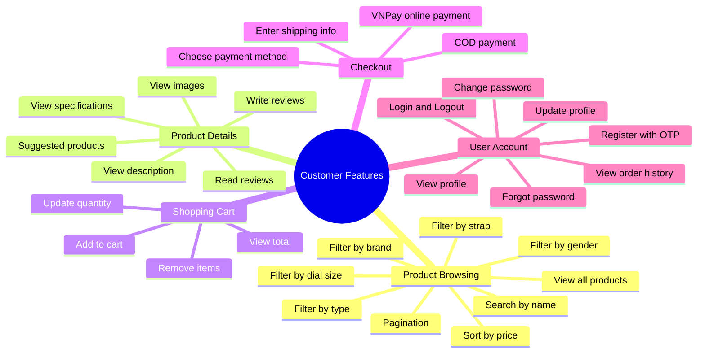
```mermaid
mindmap
  root((Customer Features))
    Product Browsing
      View all products
      Filter by brand
      Filter by type
      Filter by strap
      Filter by dial size
      Filter by gender
      Search by name
      Sort by price
      Pagination
    Product Details
      View images
      View description
      View specifications
      Read reviews
      Write reviews
      Suggested products
    Shopping Cart
      Add to cart
      Update quantity
      Remove items
      View total
    Checkout
      Enter shipping info
      Choose payment method
      COD payment
      VNPay online payment
    User Account
      Register with OTP
      Login and Logout
      View profile
      Update profile
      Change password
      Forgot password
      View order history
```

### 13.2 Admin Features

```mermaid
mindmap
  root((Admin Features))
    Dashboard
      Total products
      Total invoices
      Total revenue
      Invoice status chart
      Monthly revenue chart
      Products by brand chart
      Date range filter
    Product Management
      View all products
      Add new product
      Edit product
      Delete product
    Category Management
      Manage brands
      Manage types
      Manage straps
      Manage dial sizes
    Order Management
      View all orders
      Update order status
      Filter by date
    User Management
      View all users
      Edit user roles
      Delete users
```

### 13.3 Technical Features

| Feature | Implementation |
|---------|----------------|
| Authentication | Spring Security with custom provider |
| Authorization | Role-based access control (RBAC) |
| OTP Verification | In-memory storage with expiration |
| Email Service | Spring Mail with Gmail SMTP |
| Online Payment | VNPay sandbox integration |
| Dynamic Queries | JPA Specifications for filtering |
| Pagination | Spring Data Pageable |
| Session Management | HTTP Session for cart and user |
| Template Engine | Thymeleaf with Spring Security integration |
| Data Validation | JPA constraints and manual validation |

---

## Appendix

### A. Glossary

| Term | Definition |
|------|------------|
| MPDS | Project codename for Watch Store |
| OTP | One-Time Password for verification |
| VNPay | Vietnamese online payment gateway |
| COD | Cash On Delivery payment method |
| DTO | Data Transfer Object |
| JPA | Java Persistence API |
| RBAC | Role-Based Access Control |

### B. Version History

| Version | Date | Changes |
|---------|------|---------|
| 1.0.0 | 2024-06-26 | Initial release |

### C. Contact

- **Developer**: Viet Anh Nguyen
- **Email**: vietanhnguyen.071002@gmail.com

---

*This documentation was auto-generated based on source code analysis.*
